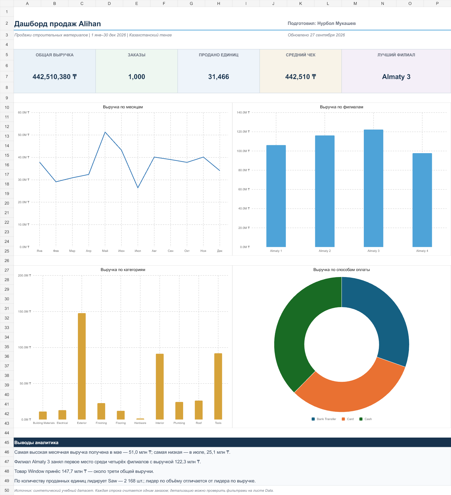

# Alihan Analytics — анализ продаж

Учебный проект для портфолио Junior Data Analyst. В проекте проанализированы 1 000 операций по продаже строительных материалов. Исходный Excel-файл преобразован в проверяемый Excel-дашборд и набор аналитических SQL-запросов для PostgreSQL.



## Цель проекта

Показать полный процесс работы аналитика: проверку данных, расчёт KPI, создание Excel-дашборда, SQL-анализ и формулирование выводов.

## Бизнес-вопросы

- Как менялась выручка по месяцам?
- Какой филиал принёс больше всего выручки?
- Какие товары и категории лидируют по выручке и количеству?
- Как распределяется выручка по способам оплаты?
- Какие клиенты и менеджеры обеспечили наибольший объём продаж?

## Основные показатели

| Показатель | Результат |
|---|---:|
| Общая выручка | 442 510 380 ₸ |
| Количество заказов | 1 000 |
| Продано единиц | 31 466 |
| Средний чек | 442 510 ₸ |
| Лучший филиал | Almaty 3 — 122 349 160 ₸ |
| Лучший товар по выручке | Window — 147 744 000 ₸ |
| Лучший товар по количеству | Saw — 2 168 единиц |

## Основные выводы

1. **Almaty 3 стал лучшим филиалом** и обеспечил 27,6% общей выручки.
2. **Май был самым сильным месяцем** с выручкой 50 982 520 ₸. Минимальная выручка зафиксирована в июле — 25 057 280 ₸.
3. **Window лидирует по выручке** с результатом 147 744 000 ₸. По количеству проданных единиц лидирует Saw.
4. **Exterior является крупнейшей категорией по выручке** и полностью сформирована продажами Window.
5. Выручка по способам оплаты: Cash — 37,6%, Card — 32,0%, Bank Transfer — 30,4%.

## Структура проекта

```text
Alihan-Analytics/
├── README.md
├── data/
│   ├── sales_data.xlsx
│   └── sales_data.csv
├── excel/
│   └── Alihan_Sales_Dashboard.xlsx
├── sql/
│   ├── schema.sql
│   ├── analysis_queries.sql
│   ├── validation_queries.sql
│   └── README.md
├── images/
│   └── dashboard.png
└── docs/
    └── data_dictionary.md
```

## Excel-дашборд

- **Dashboard** — основные KPI и четыре диаграммы.
- **Analysis** — формульные расчёты для дашборда.
- **Data** — 1 000 исходных строк и поле `Month`.
- **Guide** — определения показателей и правила обновления.

Расчёты выполнены с помощью `SUMIFS`, `COUNTIFS`, `INDEX`, `MATCH`, `SUM` и прямых ссылок между листами. KPI связаны с исходными данными формулами.

## SQL-анализ

Подготовлено 20 запросов для PostgreSQL 14+: агрегирование, `CASE`, `HAVING`, CTE, `LAG`, `ROW_NUMBER`, `DENSE_RANK`, месячный рост, скользящее среднее и накопительная доля выручки.

## Запуск SQL

```bash
createdb alihan_analytics
psql -d alihan_analytics -f sql/schema.sql
psql -d alihan_analytics -c "\copy sales(order_date,branch,manager,customer,product,category,quantity,unit_price,revenue,payment_method) FROM 'data/sales_data.csv' WITH (FORMAT csv, HEADER true)"
psql -d alihan_analytics -f sql/validation_queries.sql
psql -d alihan_analytics -f sql/analysis_queries.sql
```

## Проверка качества данных

- 1 000 строк и 442 510 380 ₸ выручки;
- 31 466 проданных единиц;
- нет пустых значений в обязательных полях;
- `Revenue = Quantity × Unit Price` в каждой строке;
- период: 1 января — 30 декабря 2026 года;
- 4 филиала, 20 товаров, 10 категорий и 3 способа оплаты.

## Ограничения

- Датасет синтетический и предназначен для обучения.
- Из-за отсутствия `Order ID` каждая строка считается заказом.
- Нет себестоимости, прибыли, скидок и возвратов, поэтому анализ маржи не выполнялся.

## Описание для резюме

> Создал учебный проект по анализу 1 000 операций продаж в Excel и PostgreSQL. Разработал формульный дашборд с KPI и четырьмя диаграммами, выполнил проверки качества данных и SQL-анализ с использованием CTE и оконных функций.

